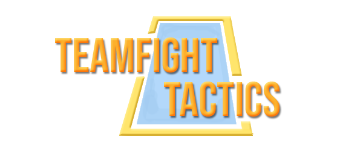
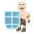
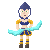
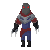
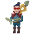
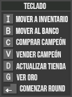

# TeamFight Tactics

## Desarrolladores
- Mattei Felipe ([Github](https://github.com/FeliMattei))
- Orlando Agustín ([Github](https://github.com/AgustinOrlando))
- Samudio Leandro Ivan ([Github](https://github.com/LeandroSamudio))
- Taveira Quercia Juan José ([Github](https://github.com/JuanchiTaveira))

Realizamos este proyecto como trabajo práctico integrador para la materia Paradigmas de Programación en la UTN.

## Introducción

Basado en el League Of Legends, TeamFight Tactics es un juego de estrategia individual por rondas, en el cual tendrás que comprar campeones y armar sinergias entre ellos para vencer al enemigo.  

## ¿Cómo jugar?

El juego se desarrolla en una arena donde se llevará a cabo el combate, encabezado por un jugador y un rival. Con el oro inicial deberás adquirir un [campeón](https://github.com/FeliMattei/TeamFight-Tactics/blob/master/README.md#campeones) de la tienda para iniciar el primer round *(Podés guiarte con la configuración del [teclado](https://github.com/FeliMattei/TeamFight-Tactics/blob/master/README.md#configuración-del-teclado))*.  
A medida que avancen las rondas subirás de nivel, lo que te permitirá colocar en la arena más campeones para la lucha. Además, sumarás oro al finalizar cada una de ellas.  
En el caso de perder, se le restará vida al jugador dependiendo de la cantidad de campeones enemigos y del round en el que se encuentren.  

La partida finalizará cuando muera alguno de los jugadores.

## Campeones

Son los encargados de combatir en la arena. Cada uno de ellos se mueve de manera independiente, según la [estrategia de búsqueda](https://github.com/FeliMattei/TeamFight-Tactics/blob/master/README.md#estrategia-de-búsqueda) planificada.  
Cada campeón posee una [habilidad](https://github.com/FeliMattei/TeamFight-Tactics/blob/master/README.md#habilidades) y un rol que, al acumular una determinada cantidad de campeones con dicho rol, se activará una [sinergia](https://github.com/FeliMattei/TeamFight-Tactics/blob/master/README.md#sinergias) que modificará sus estadísticas.

### Braum

   *"El corazón es el músculo más fuerte"*

#### Estadísticas:  
Precio: 1  
Vida: 640  
Armadura: 45  
Resistencia Mágica: 30  
Rango: 1  
Daño Mágico: 0  
Daño Básico: 0  
Velocidad de Ataque: 1800  
Rol: Scout  
Habilidad: [Devolver Daño](https://github.com/FeliMattei/TeamFight-Tactics/blob/master/README.md#devolver-daño) o [Ponerse Duro](https://github.com/FeliMattei/TeamFight-Tactics/blob/master/README.md#ponerse-duro)  
Criterio de búsqueda: El más cercano  
Acumula maná al recibir ataques.  

### Ashe

   *"Todo el mundo en una flecha"*

#### Estadísticas:  
Precio: 2  
Vida: 500  
Armadura: 5  
Resistencia Mágica: 5  
Rango: 2  
Daño Mágico: 3  
Daño Básico: 70  
Velocidad de Ataque: 1450  
Rol: Tirador  
Habilidad: [Flecha Encantada](https://github.com/FeliMattei/TeamFight-Tactics/blob/master/README.md#flecha-encantada)  
Criterio de Búsqueda: El más cercano  
Acumula maná al atacar a un oponente.  

### Zed

   *"La espada invisible es la mas mortífera"*

#### Estadísticas:  
Precio: 2  
Vida: 500  
Armadura: 10  
Resistencia Mágica: 15  
Rango: 1  
Daño Mágico: 3  
Daño Básico: 55  
Velocidad de Ataque: 1250  
Rol: Asesino  
Habilidad: [Cuchillada Sombría](https://github.com/FeliMattei/TeamFight-Tactics/blob/master/README.md#cuchillada-sombría)  
Criterio de Búsqueda: El más cercano  
Ejecuta la habilidad sin requerir de la maná.

### Vayne

   *"Persigamos a los que han caído en la oscuridad"*

#### Estadísticas:  
Precio: 3  
Vida: 430  
Armadura: 10  
Resistencia Mágica: 5  
Rango: 2  
Daño Mágico: 3  
Daño Básico: 70  
Velocidad de Ataque: 1400  
Criterio de Búsqueda: El más cercano  
Rol: Tirador  
Habilidad: [Proyectil de Plata](https://github.com/FeliMattei/TeamFight-Tactics/blob/master/README.md#proyectil-de-plata)  
Criterio de Búsqueda: El más cercano  
Acumula maná al atacar a un oponente.

## Habilidades
Cada habilidad necesita un requerimiento de maná para su ejecución, que se obtendrá dependiendo del campeón.  

#### Ataque básico
Utilizada por casi todos los campeones. Causará daño básico al oponente, cuya gravedad dependerá de la armadura.  

#### Flecha encantada
Realizará un ataque mágico en forma de flecha encantada, cuyo daño es igual a cuatro veces su daño básico.  

#### Devolver daño
El campeón recibirá la mitad del daño y le devolverá al enemigo la otra mitad.  

#### Ponerse duro
Bloqueará el siguiente ataque del enemigo.  

#### Proyectil de plata
El campeón realizará un ataque de daño verdadero, igual al doble de su daño básico.  

#### Cuchillada sombría
El campeón achuchillará al rival causándole un daño básico y recuperará la mitad del daño en forma de vida.  

## Criterio de búsqueda
Los campeones poseen un criterio que van a usar al momento de seleccionar un objetivo para atacar.  

### El más cercano
Atacará al campeón que se encuentre más cerca.  

### El de menos vida
Localizará al campeón enemigo con menos vida para atacarlo.  

## Sinergias

Se forman mediante la combinación de roles para modificar las estadísticas de cada campeón, y se activará al iniciar el combate.  

### Tiradores
  

• Necesita dos campeones con este rol para activarse.  
• Los que cumplan con este requisito se les duplicará el rango de ataque.  

### Asesinos
  

• Necesita dos campeones con este rol para activarse.  
• Los que cumplan con este requisito se les duplicará la velocidad de ataque.  

### Scouts
  

• Necesita tres campeones con este rol para activarse.  
• El criterio de búsqueda de los Scouts cambiará al más cercano.  

## Configuración del teclado
Cada tecla activará un modo para ejecutar distintas acciones. 

La posición de cada campeón (slot) está representada por las teclas del **Num1** al **Num9**, y su funcionalidad va a variar de acuerdo al modo en el que se encuentre.  

  
**Tecla I:** Mover un campeón del banco al inventario.  
**Tecla B:** Mover un campeón del inventario al banco.  
**Tecla C:** Comprar campeones.  
**Tecla V:** Vender campeones de la banca.  
**Tecla D:** Actualizar tienda (aleatoria).  
**Tecla G:** Visualizar oro actual.  
**Tecla Enter:** Comenzar round.  
